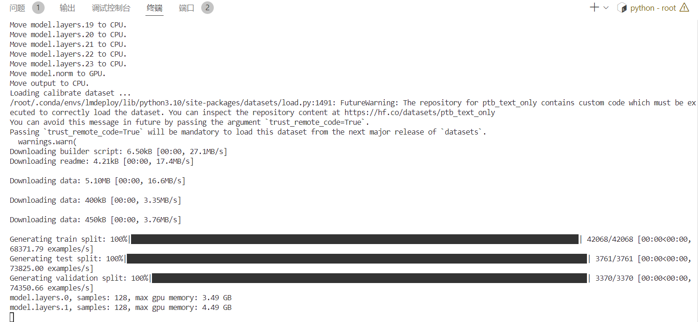

# 本节任务要点

- 使用结合W4A16量化与kv cache量化的`internlm2_5-1_8b-chat`模型封装本地API并与大模型进行一次对话，作业截图需包括显存占用情况与大模型回复，参考4.1 API开发(优秀学员必做)，**请注意2.2.3节与4.1节应使用作业版本命令。**
- 使用Function call功能让大模型完成一次简单的"加"与"乘"函数调用，作业截图需包括大模型回复的工具调用情况，参考4.2 Function call(选做)

# 实践流程

选择 **Cuda12.2-conda 30%A100 **  (24GB显存容量)

我们要运行参数量为7B的InternLM2.5，由[InternLM2.5的码仓](https://huggingface.co/internlm/internlm2_5-7b-chat/blob/main/config.json)查询InternLM2.5-7b-chat的config.json文件可知，该模型的权重被存储为`bfloat16`格式

对于一个7B（70亿）参数的模型，每个参数使用16位浮点数（等于 2个 Byte）表示，则模型的权重大小约为：

**70×10^9 parameters×2 Bytes/parameter=14GB**

**70亿个参数×每个参数占用2个字节=14GB**

所以我们需要大于14GB的显存

在终端中，让我们输入以下指令，来创建一个名为lmdeploy的conda环境，python版本为3.10，创建成功后激活环境并安装0.5.3版本的lmdeploy及相关包。

```
conda create -n lmdeploy  python=3.10 -y
conda activate lmdeploy
conda install pytorch==2.1.2 torchvision==0.16.2 torchaudio==2.1.2 pytorch-cuda=12.1 -c pytorch -c nvidia -y
pip install timm==1.0.8 openai==1.40.3 lmdeploy[all]==0.5.3
```

## InternStudio环境获取模型

为方便文件管理，我们需要一个存放模型的目录，本教程统一放置在`/root/project/deploy/models/`目录。

运行以下命令，创建文件夹并设置开发机共享目录的软链接。

```txt
ln -s /root/share/new_models/Shanghai_AI_Laboratory/internlm2_5-7b-chat /root/project/deploy/models/
ln -s /root/share/new_models/Shanghai_AI_Laboratory/internlm2_5-1_8b-chat /root/project/deploy/models/
ln -s /root/share/new_models/OpenGVLab/InternVL2-26B /root/project/deploy/models/
```

此时，我们可以看到`/root/models`中会出现`internlm2_5-7b-chat`、`internlm2_5-1_8b-chat`和`InternVL2-26B`文件夹。

教程使用internlm2_5-7b-chat和InternVL2-26B作为演示。

由于上述模型量化会消耗大量时间(约8h)

**量化作业请使用internlm2_5-1_8b-chat模型**完成。

## LMDeploy验证启动模型文件

在量化工作正式开始前，我们还需要验证一下获取的模型文件能否正常工作，以免竹篮打水一场空。

进入创建好的conda环境并启动internlm2_5-1_8b-chat

```txt
conda activate lmdeploy
lmdeploy chat /root/project/deploy/models/internlm2_5-1_8b-chat
```

需要按**两次回车**才能够执行，以下为示例。


显存 20816


## LMDeploy API部署InternLM2.5

### 以命令行形式连接API服务器

首先让我们进入创建好的conda环境，并通下命令启动API服务器，部署InternLM2.5模型：

```txt
conda activate lmdeploy
lmdeploy serve api_server \
    /root/project/deploy/models/internlm2_5-1_8b-chat \
    --model-format hf \
    --quant-policy 0 \
    --server-name 0.0.0.0 \
    --server-port 23333 \
    --tp 1
```

命令解释：

1. `lmdeploy serve api_server`：这个命令用于启动API服务器。
2. `/root/models/internlm2_5-1_8b-chat`：这是模型的路径。
3. `--model-format hf`：这个参数指定了模型的格式。`hf`代表“Hugging Face”格式。
4. `--quant-policy 0`：这个参数指定了量化策略。
5. `--server-name 0.0.0.0`：这个参数指定了服务器的名称。在这里，`0.0.0.0`是一个特殊的IP地址，它表示所有网络接口。
6. `--server-port 23333`：这个参数指定了服务器的端口号。在这里，`23333`是服务器将监听的端口号。
7. `--tp 1`：这个参数表示并行数量（GPU数量）。

然后打开浏览器，访问`http://127.0.0.1:23333`看到如下界面即代表部署成功。


运行如下命令，激活conda环境并启动命令行客户端。

```
conda activate lmdeploy
lmdeploy serve api_client http://localhost:23333
```

稍待片刻，等出现`double enter to end input >>>`的输入提示即启动成功，此时便可以随意与InternLM2.5对话，同样是两下回车确定，输入`exit`退出。


### 以Gradio**网页形式连接API服务器**

保持第一个终端不动，在新建终端中输入`exit`退出。

输入以下命令，使用Gradio作为前端，启动网页。

```
lmdeploy serve gradio http://localhost:23333 \
    --server-name 0.0.0.0 \
    --server-port 6006
```

打开浏览器，访问地址`http://127.0.0.1:6006`，然后就可以与模型尽情对话了。


## LMDeploy Lite

### 设置最大kv cache缓存大小

kv cache是一种缓存技术，通过存储键值对的形式来复用计算结果，以达到提高性能和降低内存消耗的目的。在大规模训练和推理中，kv cache可以显著减少重复计算量，从而提升模型的推理速度。理想情况下，kv cache全部存储于显存，以加快访存速度。

模型在运行时，占用的显存可大致分为三部分：模型参数本身占用的显存、kv cache占用的显存，以及中间运算结果占用的显存。LMDeploy的kv cache管理器可以通过设置`--cache-max-entry-count`参数，控制kv缓存占用**剩余显存**的最大比例。默认的比例为0.8。

```
lmdeploy chat /root/project/deploy/models/internlm2_5-1_8b-chat --cache-max-entry-count 0.4
```

### 设置**在线** kv cache int4/int8 量化

自 v0.4.0 起，LMDeploy 支持在线 kv cache int4/int8 量化，量化方式为 per-head per-token 的非对称量化。此外，通过 LMDeploy 应用 kv 量化非常简单，只需要设定 `quant_policy` 和`cache-max-entry-count`参数。目前，LMDeploy 规定 `quant_policy=4` 表示 kv int4 量化，`quant_policy=8` 表示 kv int8 量化。

输入以下指令，启动API服务器。

```
lmdeploy serve api_server \
    /root/project/deploy/models/internlm2_5-1_8b-chat \
    --model-format hf \
    --quant-policy 4 \
    --cache-max-entry-count 0.4\
    --server-name 0.0.0.0 \
    --server-port 23333 \
    --tp 1
```


```
lmdeploy serve api_client http://localhost:23333
```


### W4A16 模型量化和部署

准确说，模型量化是一种优化技术，旨在减少机器学习模型的大小并提高其推理速度。量化通过将模型的权重和激活从高精度（如16位浮点数）转换为低精度（如8位整数、4位整数、甚至二值网络）来实现。

那么标题中的W4A16又是什么意思呢？

- W4：这通常表示权重量化为4位整数（int4）。这意味着模型中的权重参数将从它们原始的浮点表示（例如FP32、BF16或FP16，**Internlm2.5精度为BF16**）转换为4位的整数表示。这样做可以显著减少模型的大小。
- A16：这表示激活（或输入/输出）仍然保持在16位浮点数（例如FP16或BF16）。激活是在神经网络中传播的数据，通常在每层运算之后产生。

因此，W4A16的量化配置意味着：

- 权重被量化为4位整数。
- 激活保持为16位浮点数。

让我们回到LMDeploy，在最新的版本中，LMDeploy使用的是AWQ算法，能够实现模型的4bit权重量化。输入以下指令，执行量化工作。**(不建议运行，在InternStudio上运行需要8小时)**

**完成作业时请使用1.8B模型进行量化：(建议运行以下命令)**  

加一个datasets

查看：[lmdeploy 部署量化出现错误 · Issue #1893](https://github.com/InternLM/Tutorial/issues/1893)

```
pip install datasets==2.19.2

lmdeploy lite auto_awq \
  /root/project/deploy/models/internlm2_5-1_8b-chat \
  --calib-dataset 'ptb' \
  --calib-samples 128 \
  --calib-seqlen 2048 \
  --w-bits 4 \
  --w-group-size 128 \
  --batch-size 1 \
  --search-scale False \
  --work-dir /root/project/deploy/models/internlm2_5-1_8b-chat-w4a16-4bit
```

命令解释：

1. `lmdeploy lite auto_awq`: `lite`这是LMDeploy的命令，用于启动量化过程，而`auto_awq`代表自动权重量化（auto-weight-quantization）。
2. `/root/project/deploy/models/internlm2_5-1_8b-chat`: 模型文件的路径。
3. `--calib-dataset 'ptb'`: 这个参数指定了一个校准数据集，这里使用的是’ptb’（Penn Treebank，一个常用的语言模型数据集）。
4. `--calib-samples 128`: 这指定了用于校准的样本数量—128个样本
5. `--calib-seqlen 2048`: 这指定了校准过程中使用的序列长度—2048
6. `--w-bits 4`: 这表示权重（weights）的位数将被量化为4位。
7. `--work-dir /root/project/deploy/models/internlm2_5-1_8b-chat-w4a16-4bit`: 这是工作目录的路径，用于存储量化后的模型和中间结果

等待推理完成，便可以直接在你设置的目标文件夹看到对应的模型文件。



那么推理后的模型和原本的模型区别在哪里呢？最明显的两点是模型文件大小以及占据显存大小。

我们可以输入如下指令查看在当前目录中显示所有子目录的大小。


那么显存占用情况对比呢？输入以下指令启动量化后的模型。

```
lmdeploy chat /root/project/deploy/models/internlm2_5-1_8b-chat-w4a16-4bit --model-format awq
```

显存 20200


### W4A16 量化+ KV cache+KV cache 量化

```
lmdeploy serve api_server \
    /root/project/deploy/models/internlm2_5-1_8b-chat-w4a16-4bit \
    --model-format awq \
    --quant-policy 4 \
    --cache-max-entry-count 0.4 \
    --server-name 0.0.0.0 \
    --server-port 23333 \
    --tp 1
```

显存 11364


## LMDeploy之FastAPI与Function call

之前在启动API服务器是借助FastAPI封装一个API出来让LMDeploy自行进行访问，在这一章节中我们将依托于LMDeploy封装出来的API进行更加灵活更具DIY的开发。

###  API开发

与之前一样，让我们进入创建好的conda环境并输入指令启动API服务器。

```txt
conda activate lmdeploy
lmdeploy serve api_server \
    /root/project/deploy/models/internlm2_5-1_8b-chat-w4a16-4bit \
    --model-format awq \
    --cache-max-entry-count 0.4 \
    --quant-policy 4 \
    --server-name 0.0.0.0 \
    --server-port 23333 \
    --tp 1
```

在新建终端中输入如下指令，新建`internlm2_5.py`。

```txt
touch /root/project/deploy/internlm2_5.py
```

将以下内容复制粘贴进`internlm2_5.py`。

```
# 导入openai模块中的OpenAI类，这个类用于与OpenAI API进行交互
from openai import OpenAI


# 创建一个OpenAI的客户端实例，需要传入API密钥和API的基础URL
client = OpenAI(
    api_key='YOUR_API_KEY',  
    # 替换为你的OpenAI API密钥，由于我们使用的本地API，无需密钥，任意填写即可
    base_url="http://0.0.0.0:23333/v1"  
    # 指定API的基础URL，这里使用了本地地址和端口
)

# 调用client.models.list()方法获取所有可用的模型，并选择第一个模型的ID
# models.list()返回一个模型列表，每个模型都有一个id属性
model_name = client.models.list().data[0].id

# 使用client.chat.completions.create()方法创建一个聊天补全请求
# 这个方法需要传入多个参数来指定请求的细节
response = client.chat.completions.create(
  model=model_name,  
  # 指定要使用的模型ID
  messages=[  
  # 定义消息列表，列表中的每个字典代表一个消息
    {"role": "system", "content": "你是一个友好的小助手，负责解决问题."},  
    # 系统消息，定义助手的行为
    {"role": "user", "content": "帮我讲述一个关于男人华强和西瓜的小故事"},  
    # 用户消息，询问时间管理的建议
  ],
    temperature=0.8,  
    # 控制生成文本的随机性，值越高生成的文本越随机
    top_p=0.8  
    # 控制生成文本的多样性，值越高生成的文本越多样
)

# 打印出API的响应结果
print(response.choices[0].message.content)
```

现在让我们在新建终端输入以下指令激活环境并运行python代码。

```
conda activate lmdeploy
python /root/project/deploy/internlm2_5.py
```


### Function call

关于Function call，即函数调用功能，它允许开发者在调用模型时，详细说明函数的作用，并使模型能够智能地根据用户的提问来输入参数并执行函数。完成调用后，模型会将函数的输出结果作为回答用户问题的依据。

首先让我们进入创建好的conda环境并启动API服务器。

```txt
conda activate lmdeploy
lmdeploy serve api_server \
    /root/project/deploy/models/internlm2_5-7b-chat \
    --model-format hf \
    --quant-policy 0 \
    --server-name 0.0.0.0 \
    --server-port 23333 \
    --tp 1
```

目前LMDeploy在0.5.3版本中支持了对InternLM2, InternLM2.5和llama3.1这三个模型，故我们选用InternLM2.5 封装API。

让我们使用一个简单的例子作为演示。输入如下指令，新建`internlm2_5_func.py`。

```txt
touch /root/project/deploy/internlm2_5_func.py
```

双击打开，并将以下内容复制粘贴进`internlm2_5_func.py`。

```
from openai import OpenAI


def add(a: int, b: int):
    return a + b


def mul(a: int, b: int):
    return a * b


tools = [{
    'type': 'function',
    'function': {
        'name': 'add',
        'description': 'Compute the sum of two numbers',
        'parameters': {
            'type': 'object',
            'properties': {
                'a': {
                    'type': 'int',
                    'description': 'A number',
                },
                'b': {
                    'type': 'int',
                    'description': 'A number',
                },
            },
            'required': ['a', 'b'],
        },
    }
}, {
    'type': 'function',
    'function': {
        'name': 'mul',
        'description': 'Calculate the product of two numbers',
        'parameters': {
            'type': 'object',
            'properties': {
                'a': {
                    'type': 'int',
                    'description': 'A number',
                },
                'b': {
                    'type': 'int',
                    'description': 'A number',
                },
            },
            'required': ['a', 'b'],
        },
    }
}]
messages = [{'role': 'user', 'content': 'Compute (114+514)*2'}]

client = OpenAI(api_key='YOUR_API_KEY', base_url='http://0.0.0.0:23333/v1')
model_name = client.models.list().data[0].id
response = client.chat.completions.create(
    model=model_name,
    messages=messages,
    temperature=0.8,
    top_p=0.8,
    stream=False,
    tools=tools)
print("-"*25)
print(response)
func1_name = response.choices[0].message.tool_calls[0].function.name
func1_args = response.choices[0].message.tool_calls[0].function.arguments
func1_out = eval(f'{func1_name}(**{func1_args})')
print("func1_name", func1_name)
print("func1_args", func1_args)
print(func1_out)
print("-"*25)

messages.append({
    'role': 'assistant',
    'content': response.choices[0].message.content
})
messages.append({
    'role': 'environment',
    'content': f'114+514={func1_out}',
    'name': 'plugin'
})

response = client.chat.completions.create(
    model=model_name,
    messages=messages,
    temperature=0.8,
    top_p=0.8,
    stream=False,
    tools=tools)
print("-"*25)
print(response)
func2_name = response.choices[0].message.tool_calls[0].function.name
func2_args = response.choices[0].message.tool_calls[0].function.arguments
print("func1_name", func2_name)
print("func1_args", func2_args)
func2_out = eval(f'{func2_name}(**{func2_args})')
print(func2_out)
```

现在让我们输入以下指令运行python代码。

```
python /root/project/deploy/internlm2_5_func.py
```

稍待片刻终端输出如下。（有一定的概率问题）


# 总结

1. 量化是个好东西，减小显存
2. 自己实现函数调用，很灵活