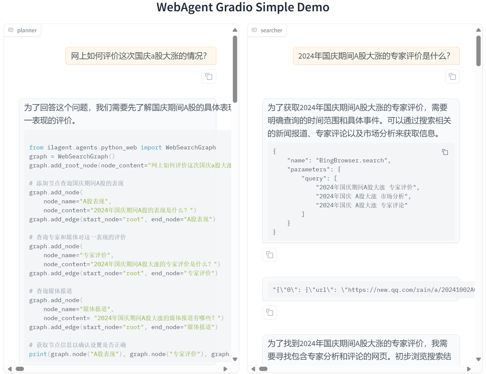

# 本节任务要点

- 按照教程，将 MindSearch 部署到 HuggingFace 并美化 Gradio 的界面，并提供截图和 Hugging Face 的Space的链接。

# 实践流程

随着硅基流动提供了免费的 InternLM2.5-7B-Chat 服务（免费的 InternLM2.5-7B-Chat 真的很香），MindSearch 的部署与使用也就迎来了纯 CPU 版本，进一步降低了部署门槛。那就让我们来一起看看如何使用硅基流动的 API 来部署 MindSearch 吧。

## 创建开发机 & 环境配置

打开[codespace主页](https://github.com/codespaces)，选择blank template。浏览器会自动在新的页面打开一个web版的vscode。

接下来的操作就和我们使用vscode基本没差别了。

然后我们新建一个目录用于存放 MindSearch 的相关代码，并把 MindSearch 仓库 clone 下来。在终端中运行下面的命令：

```
mkdir -p /workspaces/mindsearch
cd /workspaces/mindsearch
git clone https://github.com/InternLM/MindSearch.git
cd MindSearch && git checkout b832275 && cd ..
```

接下来，我们创建一个 conda 环境来安装相关依赖。

```
# 创建环境
conda create -n mindsearch python=3.10 -y
# 激活环境
conda activate mindsearch
# requirements.txt 加上 class_registry==2.1.2
# 安装依赖
pip install -r /workspaces/mindsearch/MindSearch/requirements.txt
```

**获取硅基流动 API Key**

因为要使用硅基流动的 API Key，所以接下来便是注册并获取 API Key 了。

首先，我们打开 https://account.siliconflow.cn/login 来注册硅基流动的账号（如果注册过，则直接登录即可）。

在完成注册后，打开 https://cloud.siliconflow.cn/account/ak 来准备 API Key。首先创建新 API 密钥，然后点击密钥进行复制，以备后续使用。

## 启动 MindSearch

**启动后端**

由于硅基流动 API 的相关配置已经集成在了 MindSearch 中，所以我们可以直接执行下面的代码来启动 MindSearch 的后端。

```
export SILICON_API_KEY=第二步中复制的密钥
conda activate mindsearch
cd /workspaces/mindsearch/MindSearch
python -m mindsearch.app --lang cn --model_format internlm_silicon --search_engine DuckDuckGoSearch
```

**启动前端**

在后端启动完成后，我们打开新终端运行如下命令来启动 MindSearch 的前端。

```
conda activate mindsearch
cd /workspaces/mindsearch/MindSearch
python frontend/mindsearch_gradio.py
```

简单问一下a股相关情况



回复

```
2024年国庆期间，A股市场表现异常强劲，创下了多项历史纪录。
这一现象引发了广泛关注和深入分析，包括专家、媒体以及投资者的观点。以下是对这一事件的详细分析：

### 市场表现

1. **指数创新高**：
   - 2024年9月30日，即国庆节前的最后一个交易日，上证指数
   和深证成指均创下年内新高。上证指数突破3300点关口，深证
   成指则创下1996年以来最大的单日涨幅记录[[0]][[2]]。
   - 当天沪深两市的总成交额达到2.6万亿人民币（约合3630亿
   美元），刷新了历史纪录[[0]]。
   - 上证综指大涨8.06%，收于3336.5点；深证成指狂涨10.67%
   ，收于10,529.76点；创业板指的涨幅最高达15.36%且收于
   2175.09点[[0]]。

2. **行业表现**：
   - 半导体板块大幅飙涨；电力设备股涨幅靠前；房企和消费类
   股也先行看涨；银行股因早盘逆势下挫、收盘前涨幅垫底[[0]]。
   - A股在国庆节后的第一个交易日通常会迎来反弹[[6]][[9]]。

3. **政策影响**：
   中国政府在国庆前夕连续推出一系列景气刺激政策组合拳（如
   降准降息、放水1万亿人民币等）以提振股市和房市[[0]][[9]]。
   这些政策短期内有效拉抬了股市情绪和交易活跃度[[11]][[13]]。

4. **投资者情绪与行为**：
   A股市场的暴涨带动了投资者的乐观情绪提升至高点，许多投资
   者纷纷入市或加仓股票以期获得收益[[12]][[13]]。例如，
   部分券商甚至安排值班以应对开户热潮的到来[[12]].

### 专家评价

多位专家对此次A股大涨进行了分析和评价：

1. **高盛研究部首席中国股票策略师刘劲津**认为经济情势改善
有望推动企业盈利回升且因A股估值处于历史低位而维持对A股的
“高配”立场 [[23]]. 

2. **招商证券指出a股国庆节前后市场表现有一定的“日历效应”

3. **光大证券表示大消费板块在节假日后的市场表现通常较为
强劲 [[24]]. 

4.
外资机构普遍认为当前是加仓中国股票的好时机并预计政策连续
发力将推动市场在第四季度继续上行 [[17]][[20]]. 
此外央行资产互换举措为资本市场带来流动性支持也是此次股市
大涨的重要原因之一 [[20]]. 

5.
尽管股市大涨带来了积极的市场情绪和投资机会但专家也提醒投
资者要保持理性态度并注意风险管理如三年来父母的账户虽然回
本了3个账户但仍有较高的投资风险存在及分析师建议投资者要
笑不露齿地应对市场的波动性等观点都体现了对市场的审慎态度
和对长期投资的重视 [[16]][[25]]

### 媒体报道

多家媒体对此事件进行了详细报道：

1.
《中国a股“贺国庆”创史上最高》报道称北京当局祭出一系列景
气刺激政策导致A股指数连续数日大涨并在9月30日刷新单日
成交额史上最高纪录 {{26}}.

2.
《见证历史创业板指单日大涨10%!》指出创业板指单日大涨超
过10%带动市值一周增加10万亿元人民币 {{27}}.

3.
《澎湃新闻 | A stock market rally in China_澎湃
新闻》提到行业预测大消费板块十一假期预期提振整体领涨
且假期后全行业普涨大消费板块内部分化明显 {{40}}.

综上所述,2024年国庆期间A股指数表现出强劲上涨趋势主要
受政策利好的推动以及投资者乐观情绪的影响但长期效果仍
有待观察同时专家的分析和媒体的报道也为理解这一现象
提供了多角度视角
```

## 部署到 HuggingFace Space

最后，我们来将 MindSearch 部署到 HuggingFace Space。

我们首先打开 https://huggingface.co/spaces ，并点击 Create new Space。

在输入 Space name 并选择 License 后，选择配置：

gradio、blank、CPU basic 2 vCPU 16GB Free

然后，我们进入 Settings，配置硅基流动的 API Key。

选择 New secrets，name 一栏输入 SILICON_API_KEY，value 一栏输入你的 API Key 的内容。

最后，我们先新建一个目录，准备提交到 HuggingFace Space 的全部文件。

```
# 创建新目录
mkdir -p /workspaces/mindsearch/mindsearch_deploy
# 准备复制文件
cd /workspaces/mindsearch
cp -r /workspaces/mindsearch/MindSearch/mindsearch /workspaces/mindsearch/mindsearch_deploy
cp /workspaces/mindsearch/MindSearch/requirements.txt /workspaces/mindsearch/mindsearch_deploy
# 创建 app.py 作为程序入口
touch /workspaces/mindsearch/mindsearch_deploy/app.py
```

其中，app.py 的内容如下：

```
import json
import os

import gradio as gr
import requests
from lagent.schema import AgentStatusCode

os.system("python -m mindsearch.app --lang cn --model_format internlm_silicon &")

PLANNER_HISTORY = []
SEARCHER_HISTORY = []


def rst_mem(history_planner: list, history_searcher: list):
    '''
    Reset the chatbot memory.
    '''
    history_planner = []
    history_searcher = []
    if PLANNER_HISTORY:
        PLANNER_HISTORY.clear()
    return history_planner, history_searcher


def format_response(gr_history, agent_return):
    if agent_return['state'] in [
            AgentStatusCode.STREAM_ING, AgentStatusCode.ANSWER_ING
    ]:
        gr_history[-1][1] = agent_return['response']
    elif agent_return['state'] == AgentStatusCode.PLUGIN_START:
        thought = gr_history[-1][1].split('```')[0]
        if agent_return['response'].startswith('```'):
            gr_history[-1][1] = thought + '\n' + agent_return['response']
    elif agent_return['state'] == AgentStatusCode.PLUGIN_END:
        thought = gr_history[-1][1].split('```')[0]
        if isinstance(agent_return['response'], dict):
            gr_history[-1][
                1] = thought + '\n' + f'```json\n{json.dumps(agent_return["response"], ensure_ascii=False, indent=4)}\n```'  # noqa: E501
    elif agent_return['state'] == AgentStatusCode.PLUGIN_RETURN:
        assert agent_return['inner_steps'][-1]['role'] == 'environment'
        item = agent_return['inner_steps'][-1]
        gr_history.append([
            None,
            f"```json\n{json.dumps(item['content'], ensure_ascii=False, indent=4)}\n```"
        ])
        gr_history.append([None, ''])
    return


def predict(history_planner, history_searcher):

    def streaming(raw_response):
        for chunk in raw_response.iter_lines(chunk_size=8192,
                                             decode_unicode=False,
                                             delimiter=b'\n'):
            if chunk:
                decoded = chunk.decode('utf-8')
                if decoded == '\r':
                    continue
                if decoded[:6] == 'data: ':
                    decoded = decoded[6:]
                elif decoded.startswith(': ping - '):
                    continue
                response = json.loads(decoded)
                yield (response['response'], response['current_node'])

    global PLANNER_HISTORY
    PLANNER_HISTORY.append(dict(role='user', content=history_planner[-1][0]))
    new_search_turn = True

    url = 'http://localhost:8002/solve'
    headers = {'Content-Type': 'application/json'}
    data = {'inputs': PLANNER_HISTORY}
    raw_response = requests.post(url,
                                 headers=headers,
                                 data=json.dumps(data),
                                 timeout=20,
                                 stream=True)

    for resp in streaming(raw_response):
        agent_return, node_name = resp
        if node_name:
            if node_name in ['root', 'response']:
                continue
            agent_return = agent_return['nodes'][node_name]['detail']
            if new_search_turn:
                history_searcher.append([agent_return['content'], ''])
                new_search_turn = False
            format_response(history_searcher, agent_return)
            if agent_return['state'] == AgentStatusCode.END:
                new_search_turn = True
            yield history_planner, history_searcher
        else:
            new_search_turn = True
            format_response(history_planner, agent_return)
            if agent_return['state'] == AgentStatusCode.END:
                PLANNER_HISTORY = agent_return['inner_steps']
            yield history_planner, history_searcher
    return history_planner, history_searcher


with gr.Blocks() as demo:
    gr.HTML("""<h1 align="center">MindSearch Gradio Demo</h1>""")
    gr.HTML("""<p style="text-align: center; font-family: Arial, sans-serif;">MindSearch is an open-source AI Search Engine Framework with Perplexity.ai Pro performance. You can deploy your own Perplexity.ai-style search engine using either closed-source LLMs (GPT, Claude) or open-source LLMs (InternLM2.5-7b-chat).</p>""")
    gr.HTML("""
    <div style="text-align: center; font-size: 16px;">
        <a href="https://github.com/InternLM/MindSearch" style="margin-right: 15px; text-decoration: none; color: #4A90E2;">🔗 GitHub</a>
        <a href="https://arxiv.org/abs/2407.20183" style="margin-right: 15px; text-decoration: none; color: #4A90E2;">📄 Arxiv</a>
        <a href="https://huggingface.co/papers/2407.20183" style="margin-right: 15px; text-decoration: none; color: #4A90E2;">📚 Hugging Face Papers</a>
        <a href="https://huggingface.co/spaces/internlm/MindSearch" style="text-decoration: none; color: #4A90E2;">🤗 Hugging Face Demo</a>
    </div>
    """)
    with gr.Row():
        with gr.Column(scale=10):
            with gr.Row():
                with gr.Column():
                    planner = gr.Chatbot(label='planner',
                                         height=700,
                                         show_label=True,
                                         show_copy_button=True,
                                         bubble_full_width=False,
                                         render_markdown=True)
                with gr.Column():
                    searcher = gr.Chatbot(label='searcher',
                                          height=700,
                                          show_label=True,
                                          show_copy_button=True,
                                          bubble_full_width=False,
                                          render_markdown=True)
            with gr.Row():
                user_input = gr.Textbox(show_label=False,
                                        placeholder='帮我搜索一下 InternLM 开源体系',
                                        lines=5,
                                        container=False)
            with gr.Row():
                with gr.Column(scale=2):
                    submitBtn = gr.Button('Submit')
                with gr.Column(scale=1, min_width=20):
                    emptyBtn = gr.Button('Clear History')

    def user(query, history):
        return '', history + [[query, '']]

    submitBtn.click(user, [user_input, planner], [user_input, planner],
                    queue=False).then(predict, [planner, searcher],
                                      [planner, searcher])
    emptyBtn.click(rst_mem, [planner, searcher], [planner, searcher],
                   queue=False)

demo.queue()
demo.launch(server_name='0.0.0.0',
            server_port=7860,
            inbrowser=True,
            share=True)
```

在最后，将 /root/mindsearch/mindsearch_deploy 目录下的文件（使用 git）提交到 HuggingFace Space 即可完成部署了。将代码提交到huggingface space的流程如下：

首先huggingface创建一个有写权限的token。

然后从huggingface把空的代码仓库clone到codespace。

```
cd /workspaces/codespaces-blank
git clone https://huggingface.co/spaces/hujunyao/mindsearch
cd mindsearch
# 把token挂到仓库上，让自己有写权限
git remote set-url origin https://<user_name>:<token>@huggingface.co/spaces/<user_name>/<repo_name>
git pull origin
```

现在codespace就是本地仓库，huggingface space是远程仓库，接下来使用方法就和常规的git一样了。

```
cd /workspaces/codespaces-blank/mindsearch
cp /workspaces/mindsearch/mindsearch_deploy/* .
```

注意mindsearch文件夹其实是Mindsearch项目中的一个子文件夹，如果把这个Mindsearch的整个目录copy进来会有很多问题（git submodule无法提交代码，space中项目启动失败等）。

最后把代码提交到huggingface space会自动启动项目。

```
git add .
git commit -m "update"
git push
```

然后就可以测试啦。


输出

```
为了回答南开大学2025推荐面试研究生的条件，我们需要了
解南开大学的招生政策、推荐生资格要求以及面试流程。以
下是对南开大学2025年研究生招生政策的详细介绍：

1. 推免生政策
南开大学积极接收推荐免试研究生（推免生），并提供了详
细的网上报名流程和申请条件。推免生需登录教育部推免服
务系统完成志愿申报、查看复试通知和待录取通知等流程
[[1]][[2]]。具体申请条件包括获得本科所在高校推荐免
试研究生资格的2025年应届毕业生，外语水平需符合一定标
准，如全国大学英语六级成绩425分及以上或TOEFL成绩90
分及以上等[[6]][[7]]。

2. 专业范围及条件
南开大学各学院对接收推荐免试研究生的专业范围及条件进
行了明确规定。例如，社会学院所有专业均可接收本科所属
学科专业的学生，且要求通过全国大学英语六级考试或达到
其他相应的外语水平标准[[7]]。历史学院则要求申请人具
备一定的外语水平和学术能力[[6]]。

3. 奖学金与助学金
南开大学为推免研究生提供优厚的奖学金和助学金支持。
具体信息以学校最新文件为准[[5]]。

4. 报名时间与截止日期
南开大学的网上报名时间为10月8日至10月25日，每天
9:00-22:00；预报名时间为9月24日至9月27日，每天
9:00-22:00；初试时间为12月23日至24日（每天上午
8:30——11:30，下午14:00——17:00）[[12]]。

5. 其他注意事项
考生在填写信息时需确保信息的真实性和准确性；提交的
材料必须按照指定格式整理并发送至指定邮箱；未按要求
提交材料的申请将不被受理[[6]][[7]][[2]]。

综上所述，南开大学的2025年研究生招生政策涵盖了推
免生的详细申请流程、专业的广泛覆盖、优厚的奖学金
支持以及明确的报名时间和截止日期等信息点。这些政
策和规定旨在吸引优秀的学生加入南开大学的研究生队
伍中来提升学校的整体科研实力和社会影响力
[[1]][[2]][[5]][[6]][[7]].
```

# 总结

搜索 规划 总结 好好好

